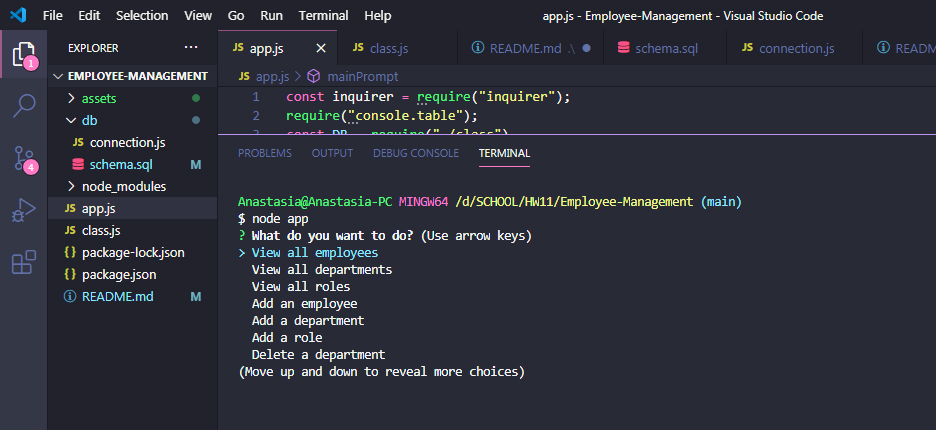
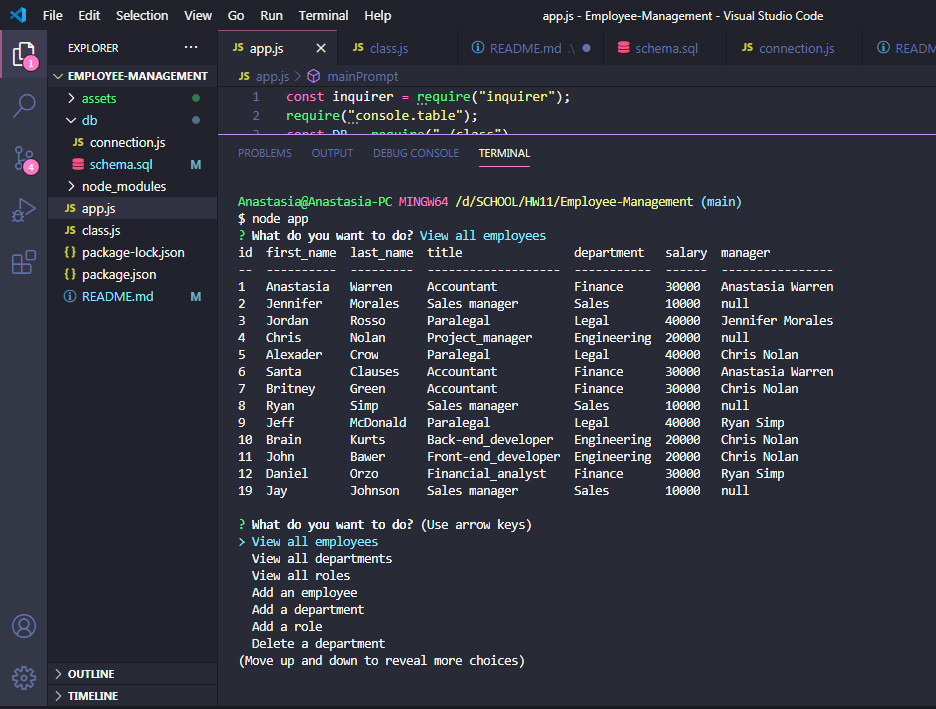
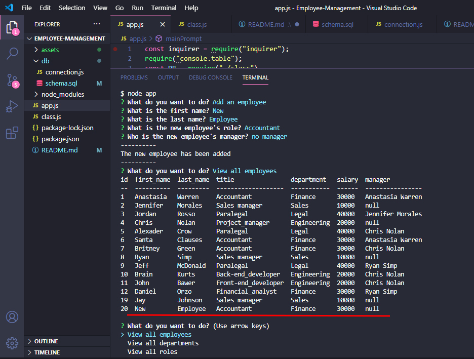

Walkthrough video link https://drive.google.com/file/d/1YhJp8QtkcK-PJFnZiCH9UEB6d7VUqwb1/view
<br>
Youtube https://www.youtube.com/watch?v=fEA2roJGC_g&feature=youtu.be

# Employee Management System 
 

## Table of Contents
  * [Description](#Description)
  * [Installation](#Installation)
  * [Usage](#Usage)
  * [Testing](#Testing)
  * [License](#License)

## Description
This application allows users to manage company's departments and employees through command line in the Node by iterating through options like view/add/delete departments or employee's positions, view/add/delete/update employees or thier roles. Everything is displayed in multiple tables that are stored in a database and seeded using SQL programming language. <br>

## Installation
To run this application, the user will need to install Node.js, and after that initialize the folder containing the application by typing `npm init -y` in the command line. The `package.json` will hold various metadata relevant to the project. This file is used to give information to npm that allows it to identify the project as well as how to handle the project's dependencies. Then the user can install  all of the required dependencies by typing `npm i`. The project was build with JavaScript and SQL programming languages. To successfully manage the employees and the whole system, the user has to run the SQL script `schema.sql` located in the `db` folder in the root directory.

```
npm init -y 
npm i
``` 
<br>

## Usage 

The user can invoke this application by opening the app.js file in the Node command line by typing `node app.js`. Then the user will be prompted with a series of questions about how he would like to manipulate the data: view/add/remove departments, view/add/remove roles, view/add/remove/update employees. <br>
Viewing options will display tables Departments(with columns `id, name`), Roles(with columns `id, title, salary, department_id`), Employees(with columns `id, first&last name, role_id, manager_id`). After choosing an option to add employee/role/department the user will be prompted with a series of questions to gather the info to add it to the table. Everytime the user will choose to add an employee, role or department a row containing the info will appear at the bottom of the chosen table. When the option `update` is chosen, the user will see a list of the options(employees) that can be updated. After every option the user will be presented with the main menu every single time until the option `Exit the application` is chosen.
<br>
Screenshots:<br>
The initial prompt: <br> 

 <br>
<br>
Table with all employees: <br>

 <br>

New employee added: <be>
 <br>
<br>

## License
Copyright © 2020 Anastasia Ivashchenko

    Permission is hereby granted, free of charge, to any person obtaining a copy of this software and associated documentation files (the "Software"), to deal in the Software without restriction, including without limitation the rights to use, copy, modify, merge, publish, distribute, sublicense, and/or sell copies of the Software, and to permit persons to whom the Software is furnished to do so, subject to the following conditions:
    
    The above copyright notice and this permission notice shall be included in all copies or substantial portions of the Software.
    
    THE SOFTWARE IS PROVIDED "AS IS", WITHOUT WARRANTY OF ANY KIND, EXPRESS OR IMPLIED, INCLUDING BUT NOT LIMITED TO THE WARRANTIES OF MERCHANTABILITY, FITNESS FOR A PARTICULAR PURPOSE AND NONINFRINGEMENT. IN NO EVENT SHALL THE AUTHORS OR COPYRIGHT HOLDERS BE LIABLE FOR ANY CLAIM, DAMAGES OR OTHER LIABILITY, WHETHER IN AN ACTION OF CONTRACT, TORT OR OTHERWISE, ARISING FROM, OUT OF OR IN CONNECTION WITH THE SOFTWARE OR THE USE OR OTHER DEALINGS IN THE SOFTWARE.
    